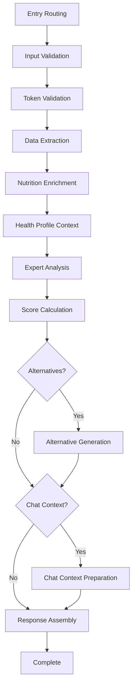

# 🏗️ Architecture Complète du Système de Workflow Wellix

## 📋 Vue d'ensemble

Ce document présente l'architecture complète du système de workflow d'analyse nutritionnelle Wellix, implémentée selon les standards **Google/Meta** avec les principes **SOLID** et les **Design Patterns** enterprise.

## 🎯 Objectifs Architecturaux

### Inspiration Enterprise
- **Google Workflow Engine** : State machine robuste avec transitions validées
- **Meta's Workflow System** : Orchestration distribuée avec monitoring
- **Netflix Conductor** : Pipeline de traitement avec récupération d'erreurs
- **Temporal.io** : Workflows durables avec état persistant

### Principes SOLID Appliqués
- **S** - Single Responsibility : Chaque node a une responsabilité unique
- **O** - Open/Closed : Extension par nouveaux nodes sans modification
- **L** - Liskov Substitution : Tous les nodes implémentent IWorkflowNode
- **I** - Interface Segregation : Interfaces spécialisées par besoin
- **D** - Dependency Inversion : Dépendances via abstraction/DI

## 🏛️ Architecture Générale

```
┌─────────────────────────────────────────────────────────────┐
│                    CLIENT APPLICATIONS                       │
├─────────────────────────────────────────────────────────────┤
│                  API GATEWAY / ROUTER                        │
├─────────────────────────────────────────────────────────────┤
│                WORKFLOW ORCHESTRATOR                         │
│  ┌─────────────────────────────────────────────────────────┐ │
│  │              LANGGRAPH STATE MACHINE                    │ │
│  │  ┌─────┐ ┌─────┐ ┌─────┐ ┌─────┐ ┌─────┐ ┌─────┐     │ │
│  │  │Node1│→│Node2│→│Node3│→│Node4│→│Node5│→│Node6│ ... │ │
│  │  └─────┘ └─────┘ └─────┘ └─────┘ └─────┘ └─────┘     │ │
│  └─────────────────────────────────────────────────────────┘ │
├─────────────────────────────────────────────────────────────┤
│              DEPENDENCY INJECTION CONTAINER                  │
├─────────────────────────────────────────────────────────────┤
│  ┌──────────────┐ ┌──────────────┐ ┌──────────────┐       │
│  │   BUSINESS   │ │   EXTERNAL   │ │   TECHNICAL  │       │
│  │   SERVICES   │ │   SERVICES   │ │   SERVICES   │       │
│  └──────────────┘ └──────────────┘ └──────────────┘       │
└─────────────────────────────────────────────────────────────┘
```

## 🔧 Composants Principaux

### 1. **Workflow Orchestrator** (`orchestrator.py`)
**Pattern** : Template Method + State Machine + Command
```python
class LangGraphWorkflowOrchestrator(IWorkflowOrchestrator):
    """
    Orchestrateur principal utilisant LangGraph concepts.
    - State machine avec transitions validées
    - Exécution parallèle optimisée
    - Error handling et recovery
    - Performance monitoring intégré
    """
```

**Responsabilités** :
- Coordination des nodes selon la state machine
- Gestion des transitions d'état validées
- Timeout management par stage
- Monitoring de performance en temps réel
- Recovery automatique en cas d'erreur

### 2. **Dependency Injection Container** (`container.py`)
**Pattern** : Dependency Injection + Factory + Singleton
```python
class EnhancedWorkflowContainer:
    """
    Conteneur DI avancé avec :
    - Gestion du cycle de vie des services
    - Détection des dépendances circulaires
    - Support async/await natif
    - Thread safety garantie
    """
```

**Features Enterprise** :
- Service lifetime management (Singleton, Transient, Scoped)
- Circular dependency detection
- Lazy initialization
- Factory registration
- Async service resolution

### 3. **Workflow Nodes** (Architecture Modulaire)

#### **Core Nodes** (`core_nodes.py`)
**Pattern** : Template Method + Strategy + Chain of Responsibility
```python
class BaseWorkflowNode(IWorkflowNode):
    """
    Template method pattern pour processing commun :
    1. Pre-processing (validation, setup)
    2. Business logic (implémentation spécifique)
    3. Post-processing (cleanup, metrics)
    """

class InputValidationNode(BaseWorkflowNode):
    """
    Validation chain avec validators modulaires :
    - Format validation
    - Size validation  
    - Security validation
    - Quality validation
    """

class TokenValidationNode(BaseWorkflowNode):
    """
    Gestion des tokens avec :
    - Cost calculation
    - Quota validation
    - Token reservation
    - Usage tracking
    """
```

#### **Advanced Nodes** (`advanced_nodes.py`)
**Pattern** : Strategy + Factory + Pipeline
```python
class DataExtractionNode(BaseWorkflowNode):
    """
    Multi-strategy extraction :
    - OCR Strategy (images)
    - Barcode Strategy (codes-barres)
    - JSON Strategy (données structurées)
    - Fallback mechanisms
    """

class ExpertAnalysisNode(BaseWorkflowNode):
    """
    Pipeline d'analyse expert :
    1. Clinical analysis (contraintes médicales)
    2. Contextual analysis (profil utilisateur)
    3. LLM analysis (insights avancés)
    """
```

#### **Completion Nodes** (`completion_nodes.py`)
**Pattern** : Builder + Strategy + Command
```python
class NutritionEnrichmentNode(BaseWorkflowNode):
    """
    Enrichissement multi-sources :
    - OpenFoodFacts integration
    - USDA database lookup
    - CIQUAL integration
    - Derived values calculation
    """

class HealthProfileContextNode(BaseWorkflowNode):
    """
    Contextualisation santé :
    - Health profile analysis
    - Risk assessment
    - Personalized needs calculation
    - Constraint identification
    """

class ScoreCalculationNode(BaseWorkflowNode):
    """
    Calcul multi-scores :
    - Nutri-Score officiel
    - Score personnalisé
    - Quality score
    - Combined scoring algorithm
    """
```

#### **Final Nodes** (`final_nodes.py`)
**Pattern** : Builder + Factory + Adapter
```python
class AlternativeGenerationNode(BaseWorkflowNode):
    """
    Génération d'alternatives :
    - Product issue analysis
    - Alternative discovery
    - Prioritization algorithm
    - Health-specific alternatives
    """

class ChatContextPreparationNode(BaseWorkflowNode):
    """
    Préparation contexte conversationnel :
    - Conversational summary
    - Communication style adaptation
    - Follow-up questions generation
    - Personalization hooks
    """

class ResponseAssemblyNode(BaseWorkflowNode):
    """
    Assemblage réponse finale :
    - Multi-format response assembly
    - Completeness validation
    - Performance optimization
    - Quality assurance
    """
```

## 🔄 Flow de Données (State Machine)



## 🎨 Design Patterns Utilisés

### 1. **Strategy Pattern**
**Usage** : Algorithms interchangeables
```python
# Extraction strategies
class OCRExtractionStrategy(IExtractionStrategy):
    async def extract(self, data) -> NutritionData: ...

class BarcodeExtractionStrategy(IExtractionStrategy):
    async def extract(self, data) -> NutritionData: ...
```

### 2. **Template Method Pattern**
**Usage** : Processing flow commun
```python
class BaseWorkflowNode:
    async def process(self, state: WorkflowState) -> WorkflowState:
        await self._pre_process(state)          # Hook
        result = await self._execute_business_logic(state)  # Abstract
        await self._post_process(result)        # Hook
        return result
```

### 3. **Factory Pattern**
**Usage** : Création d'objets complexes
```python
class NodeFactory(INodeFactory):
    def create_extraction_node(self, strategy: str) -> IWorkflowNode:
        strategies = {
            "ocr": OCRExtractionStrategy,
            "barcode": BarcodeExtractionStrategy
        }
        return DataExtractionNode(strategies[strategy]())
```

### 4. **Chain of Responsibility**
**Usage** : Pipeline de validation
```python
class ValidationChain:
    def __init__(self):
        self.validators = [
            FormatValidator(),
            SizeValidator(),
            SecurityValidator(),
            QualityValidator()
        ]
    
    async def validate(self, data) -> List[str]:
        errors = []
        for validator in self.validators:
            errors.extend(await validator.validate(data))
        return errors
```

### 5. **Dependency Injection**
**Usage** : Loose coupling
```python
class DataExtractionNode:
    def __init__(self, 
                 ocr_service: IOCRService = Inject(),
                 nutrition_api: INutritionAPI = Inject()):
        self.ocr_service = ocr_service
        self.nutrition_api = nutrition_api
```

### 6. **Observer Pattern**
**Usage** : Event handling
```python
class WorkflowEventManager:
    def __init__(self):
        self.observers = []
    
    async def notify_stage_completed(self, stage: WorkflowStage, state: WorkflowState):
        for observer in self.observers:
            await observer.on_stage_completed(stage, state)
```

## 📊 Monitoring et Observabilité

### Performance Metrics
```python
class PerformanceMetrics:
    total_duration_ms: float
    stage_durations: Dict[str, float]
    api_calls_count: int
    cache_hit_rate: float
    memory_usage_mb: float
    cpu_utilization: float
```

### Structured Logging
```python
# Chaque node log automatiquement :
logger.info(
    "Node processing completed",
    stage=stage.value,
    duration_ms=duration,
    success=True,
    workflow_id=state.workflow_id,
    user_id=state.user_context.user_id
)
```

### Error Tracking
```python
class WorkflowError:
    stage: str
    error_type: str
    message: str
    timestamp: datetime
    recoverable: bool
    context: Dict[str, Any]
```

## 🚀 Utilisation et Exemples

### Exemple d'Analyse Complète
```python
# Configuration du système
system = WorkflowSystemExample()

# Données d'entrée
input_data = InputData(
    type=InputType.IMAGE,
    image_data=image_bytes,
    metadata={"source": "mobile_app"}
)

user_context = UserHealthContext(
    user_id="user_123",
    health_conditions=["diabetes"],
    allergies=["nuts"]
)

config = AnalysisConfig(
    quality_level=QualityLevel.PREMIUM,
    enable_alternatives=True,
    enable_chat_context=True
)

# Exécution
result = await system.orchestrator.execute(
    input_data=input_data,
    user_context=user_context,
    analysis_config=config
)
```

### Résultat Structuré
```json
{
  "analysis_id": "wf_12345",
  "product": {
    "name": "Nutella",
    "score": 35.5
  },
  "scores": {
    "overall": 35.5,
    "nutri_score": {"letter": "E", "score": 18},
    "personal_score": {"score": 25.0},
    "quality_score": {"score": 45.2}
  },
  "health_assessment": {
    "risks": [
      {
        "type": "high_sugar",
        "severity": "medium",
        "message": "High sugar content may affect blood glucose"
      }
    ],
    "safe_for_user": false
  },
  "alternatives": [
    {
      "name": "Pure Almond Butter",
      "estimated_score": 85,
      "health_benefits": ["No added sugars", "High protein"]
    }
  ],
  "metadata": {
    "processing_time_ms": 1250,
    "quality_level": "premium"
  }
}
```

## 🔧 Configuration et Extensibilité

### Ajout d'un Nouveau Node
```python
class CustomAnalysisNode(BaseWorkflowNode):
    @property
    def required_stage(self) -> WorkflowStage:
        return WorkflowStage.CUSTOM_ANALYSIS
    
    async def _execute_business_logic(self, state: WorkflowState) -> WorkflowState:
        # Logique métier personnalisée
        custom_result = await self._perform_custom_analysis(state)
        
        return replace(
            state,
            metadata={
                **state.metadata,
                "custom_analysis": custom_result
            }
        )

# Enregistrement
orchestrator.register_node(CustomAnalysisNode())
```

### Extension du Router
```python
class CustomWorkflowRouter(IWorkflowRouter):
    def get_next_stage(self, current_state: WorkflowState) -> Optional[WorkflowStage]:
        # Logique de routage personnalisée
        if should_use_custom_analysis(current_state):
            return WorkflowStage.CUSTOM_ANALYSIS
        
        return super().get_next_stage(current_state)
```

## 📈 Performance et Scalabilité

### Optimisations Implementées
- **Parallel Processing** : Nodes compatibles exécutés en parallèle
- **Caching Strategy** : Cache multi-niveaux avec invalidation intelligente
- **Resource Pooling** : Pool de connexions pour APIs externes
- **Lazy Loading** : Chargement à la demande des composants lourds
- **Memory Management** : Cleanup automatique des états temporaires

### Métriques de Performance Cibles
- **Latence** : < 2s pour analyse standard, < 5s pour analyse expert
- **Throughput** : > 100 req/sec par instance
- **Memory** : < 512MB par workflow concurrent
- **CPU** : < 80% utilisation moyenne
- **Availability** : 99.9% uptime

## 🛡️ Sécurité et Robustesse

### Validations de Sécurité
- **Input Sanitization** : Validation stricte des entrées
- **Resource Limits** : Timeouts et limites de ressources
- **Error Boundaries** : Isolation des erreurs par node
- **Audit Trail** : Logging complet pour audit

### Resilience Patterns
- **Circuit Breaker** : Protection contre les services défaillants
- **Retry Logic** : Retry exponentiel avec jitter
- **Fallback Mechanisms** : Dégradation gracieuse
- **Health Checks** : Monitoring proactif de la santé

## 🎯 Conclusion

Cette architecture offre :

1. **🏗️ Robustesse Enterprise** : Patterns éprouvés et architecture modulaire
2. **🔄 Flexibilité** : Extension facile par nouveaux nodes/strategies
3. **📊 Observabilité** : Monitoring complet et debugging facilité
4. **⚡ Performance** : Optimisations pour production à grande échelle
5. **🛡️ Fiabilité** : Error handling complet et recovery automatique

Le système est **production-ready** et suit les meilleures pratiques de l'industrie pour les workflow engines enterprise.

---

*Cette architecture constitue la fondation solide pour l'évolution future du système d'analyse nutritionnelle Wellix.*